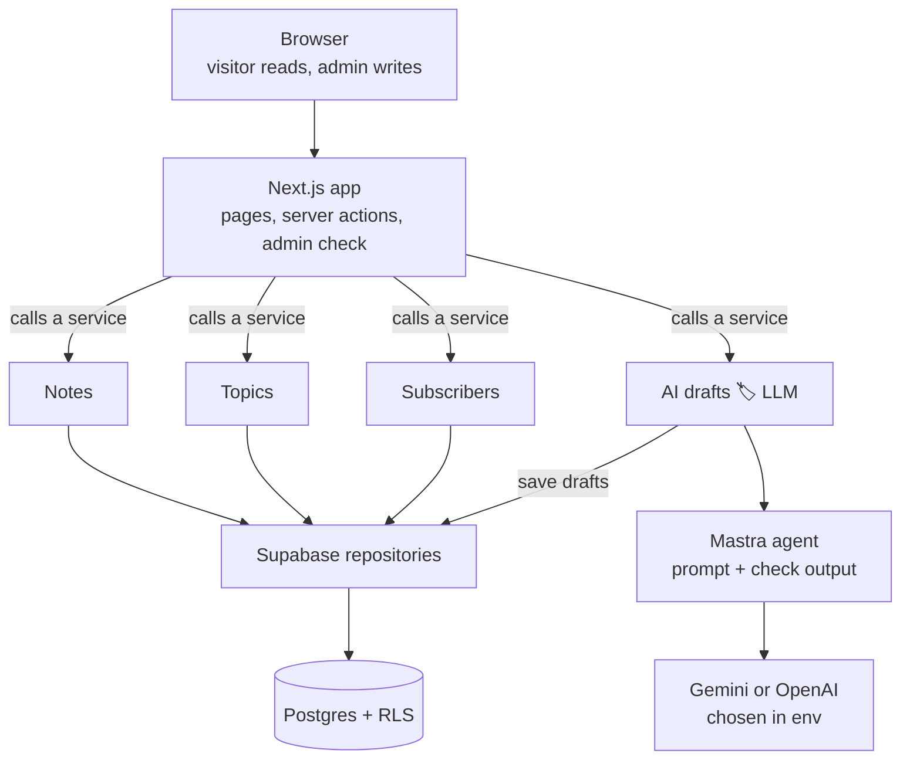
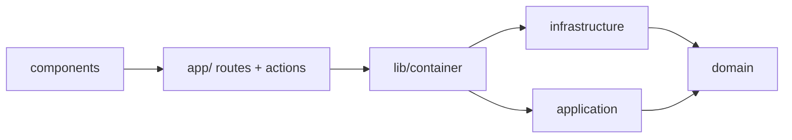
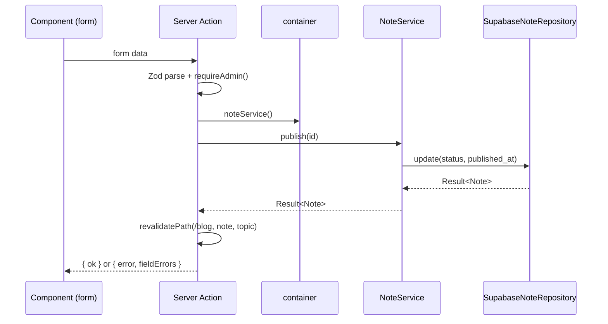
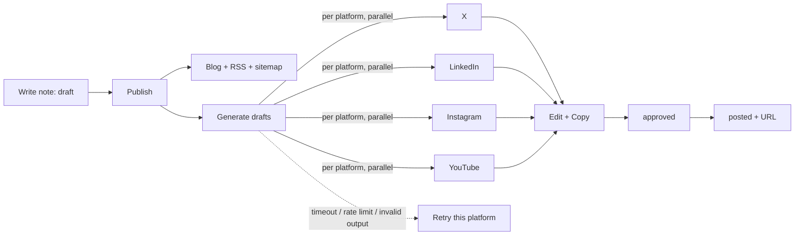

# Workflows

The single home for diagrams. Other docs link here instead of redrawing them.

## 1. The big picture

**In plain words**
1. **The browser only talks to Next.js.** Visitors get cached pages. The admin submits forms that run server actions. The browser never touches the database or the AI directly, so no secrets reach it.
2. **Next.js stays thin.** It checks the input (Zod), confirms the admin, calls one service, and shows the result.
3. **Services hold all the rules** (when a note counts as published, what makes a slug unique). They're plain TypeScript with no frameworks, so they're easy to test.
4. **Only "AI drafts" uses the LLM.** It builds a prompt per platform, asks Mastra for a draft, and checks the reply against a schema before saving it. If a platform times out, hits a rate limit or returns a bad format, only that tab shows an error, with a Retry button.
5. **Storage and AI can be swapped.** Services depend on interfaces, so switching Gemini to OpenAI is an env change, and tests use in-memory fakes.
6. **The database protects itself.** Row Level Security means the public can only read published notes, even if the app has a bug.

## 2. Layer dependencies

## 3. Admin server action (e.g. publish a note)

## 4. Visitor reading a note

`GET /blog/[slug]` → cached HTML (ISR) → on a cache miss the Server Component calls `noteService().getPublishedBySlug()` → the repo uses the cookie-less public client → RLS returns only published rows → the `<Markdown>` component renders → the result is cached until the next revalidation.

## 5. Content lifecycle

Regenerating never overwrites a draft that's `approved` or `posted` (see [F6](features/F6-ai-drafts.md)).
